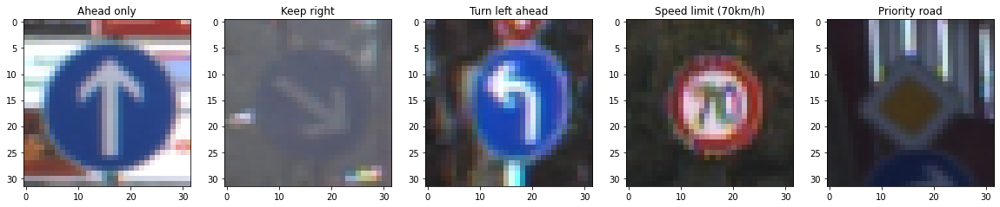
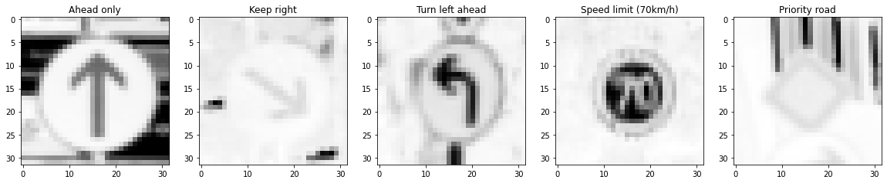
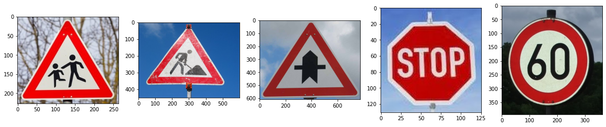

# **Traffic Sign Recognition** 

## Writeup by Sakshay Mahna

---

**Build a Traffic Sign Recognition Project**

The goals / steps of this project are the following:
* Load the data set (see below for links to the project data set)
* Explore, summarize and visualize the data set
* Design, train and test a model architecture
* Use the model to make predictions on new images
* Analyze the softmax probabilities of the new images
* Summarize the results with a written report

[//]: # (Image References)

[image1]: ./examples/visualization.jpg "Visualization"
[image2]: ./examples/grayscale.jpg "Grayscaling"
[image3]: ./examples/random_noise.jpg "Random Noise"
[image4]: ./examples/placeholder.png "Traffic Sign 1"
[image5]: ./examples/placeholder.png "Traffic Sign 2"
[image6]: ./examples/placeholder.png "Traffic Sign 3"
[image7]: ./examples/placeholder.png "Traffic Sign 4"
[image8]: ./examples/placeholder.png "Traffic Sign 5" 

---
### Writeup / README

#### 1. Provide a Writeup / README that includes all the rubric points and how you addressed each one. You can submit your writeup as markdown or pdf. You can use this template as a guide for writing the report. The submission includes the project code.

This is the writeup for the same and here is a link to the [project code](Traffic_Sign_Classifier.ipynb)

### Data Set Summary & Exploration

#### 1. Provide a basic summary of the data set. In the code, the analysis should be done using python, numpy and/or pandas methods rather than hardcoding results manually.

The numpy and pandas library were used to calculate summary statistics of the traffic
signs data set:

* The size of training set is 34799
* The size of the validation set is 4410
* The size of test set is 12630
* The shape of a traffic sign image is (32, 32, 3)
* The number of unique classes/labels in the data set is 43

#### 2. Include an exploratory visualization of the dataset.

*Random images from the training dataset*

The following are the distribution histograms:

*Distribution Histogram of Training Data*

*Distribution Histogram of Validation Data*

*Distribution Histogram of Testing Data*

### Design and Test a Model Architecture

#### 1. Describe how you preprocessed the image data. What techniques were chosen and why did you choose these techniques? Consider including images showing the output of each preprocessing technique. Pre-processing refers to techniques such as converting to grayscale, normalization, etc.

The following are the steps for preprocessing the image data:

1. The images were converted to grayscale. This reduces the shape of the original image from (32, 32, 3) to (32, 32, 1). This conversion to grayscale makes it more convenient to manipulate images and training them over the network. Here is an example of a traffic sign image before and after grayscaling.

*Images before applying grayscale*

*Images after applying grayscale*

2. The images were then normalized to have values between -1 and 1. This normalization reduces the mean to 0 which helps the Neural Network in learning the data easily.

#### 2. Describe what your final model architecture looks like including model type, layers, layer sizes, connectivity, etc.) Consider including a diagram and/or table describing the final model.

The final model consisted of the following layers:

| Layer         		|     Description	        					| 
|:---------------------:|:---------------------------------------------:| 
| Input         		| 32x32x1 Grayscale Normalized image   			| 
| Convolution 5x5     	| 1x1 stride, valid padding, outputs 28x28x10 	|
| RELU					|												|
| Max pooling	      	| 2x2 stride,  outputs 14x14x10 				|
| Convolution 5x5	    | 1x1 stride, valid padding, outputs 10x10x32   |
| RELU					|												|
| Max pooling	      	| 2x2 stride,  outputs 5x5x32 				    |
| Fully connected		| inputs 800 outputs 500       					|
| RELU					|												|
| Fully connected		| inputs 500 outputs 200       					|
| RELU					|												|
| Fully connected		| inputs 200 outputs 100       					|
| RELU					|												|
| Fully connected		| inputs 100 outputs 43       					|
| Softmax				|           									|

#### 3. Describe how you trained your model. The discussion can include the type of optimizer, the batch size, number of epochs and any hyperparameters such as learning rate.

The training of the model consisted of the following parameters:

* The optimizer used is Adam Optimizer
* The batch size used is 16
* The number of epochs were set to 30
* The learning rate used is 0.001
* The dropout probability (in terms of implementation keep probability) is 0.6

The choice of the parameters is discussed in the next section.

#### 4. Describe the approach taken for finding a solution and getting the validation set accuracy to be at least 0.93. Include in the discussion the results on the training, validation and test sets and where in the code these were calculated. Your approach may have been an iterative process, in which case, outline the steps you took to get to the final solution and why you chose those steps. Perhaps your solution involved an already well known implementation or architecture. In this case, discuss why you think the architecture is suitable for the current problem.

My final model results were:
* training set accuracy of 0.992
* validation set accuracy of 0.949 
* test set accuracy of 0.934

The code was developed by trying out different variations on the traditional LeNet architecture. Following are some of the detailed steps:

* The LeNet architecture of CNN would be useful for this task, as this network has already been used by researchers previously and has been documented to work well for this task.

* The first approach was to use two Convolutional layers of 3x3 with stride of 1 followed by Max Pool layers of 2x2 stride 2. This was further followed by a network of Fully Connected layers. This approach worked as a baseline architecture.

* The problem with this was that the validation accuracy seemed to fixate at about ~ 0.9 and training accuracy kept on increasing further.

* This architecture was adjusted to include Convolution layers of size 5x5 and addition of one more fully connected layer. This change resulted in much better performance, and raised the validation accuracy to a maximum of about ~ 0.94.

* Three learning rates were compared of which the best was choosen. Among 0.01, 0.001 and 0.0001, 0.001 gave the best training and validation accuracy. Hence, it was choosen.

* Three batch sizes were compared of which the best was choosen. Among 8, 16 and 32, 16 gave the best validation accuracy. Hence, it was choosen.

* Earlier 20 epochs were set for the training. Increasing the epochs to 30, resulted in an improvement of training and validation accuracy. Hence, it was choosen. A further increase was not taken as the training accuracy was already around ~ 0.99.

* A dropout probability of 0.6 worked to be better than 0.5 and 0.8. 0.8 probability gave higher training accuracy compared to validation accuracy. 0.5 and 0.6 had almost comparable results.
 

### Test a Model on New Images

#### 1. Choose five German traffic signs found on the web and provide them in the report. For each image, discuss what quality or qualities might be difficult to classify.

Here are five German traffic signs that I found on the web:

Some of the images that were taken from the internet contained the traffic sign along with a lot of background scenery. These were cropped to include only the traffic sign.

Of these, the 2nd and the 5th image would be slightly difficult for the classifier as they contain a perspective of the traffic sign and not the straight view.

#### 2. Discuss the model's predictions on these new traffic signs and compare the results to predicting on the test set. At a minimum, discuss what the predictions were, the accuracy on these new predictions, and compare the accuracy to the accuracy on the test set (OPTIONAL: Discuss the results in more detail as described in the "Stand Out Suggestions" part of the rubric).

Here are the results of the prediction:

| Image			                    |     Prediction	        					| 
|:---------------------------------:|:---------------------------------------------:| 
| Children Crossing                 | Children Crossing   							| 
| Road Work     		            | Road Work 									|
| Right of way at next intersection	| Right of way at next intersection				|
| Stop              	      		| Stop      					 				|
| Speed limit (60km/h)  			| Speed limit (80km/h)      					|

The model was able to correctly guess 4 of the 5 traffic signs, which gave an accuracy of 80%. This compares favorably to the accuracy on the test set of 0.934

#### 3. Describe how certain the model is when predicting on each of the five new images by looking at the softmax probabilities for each prediction. Provide the top 5 softmax probabilities for each image along with the sign type of each probability. (OPTIONAL: as described in the "Stand Out Suggestions" part of the rubric, visualizations can also be provided such as bar charts)

The code for making predictions on my final model is located in the 22nd cell of the Ipython notebook.

For the first image, the model is relatively sure that this is a children crossing (probability of 0.55), and the image does contain a children crossing. The top five soft max probabilities were

| Probability         	|     Prediction	        					| 
|:---------------------:|:---------------------------------------------:| 
| .55         			| Children crossing   							| 
| .14     				| Beware of ice/snow 							|
| .11					| Slippery road								    |
| .09	      			| Bicycles					 				    |
| .08				    | Right-of-way at the next intersection     	|

For the second image, the model is not so sure of its prediction (0.27) and wins only by a small amount from the second best prediction. The model predicts Road work and the correct label is also Road work. The top five soft max probabilities were

| Probability         	|     Prediction	        					| 
|:---------------------:|:---------------------------------------------:| 
| .27         			| Road work  									| 
| .22     				| Speed limit (80km/h) 							|
| .18					| Beware of ice/snow							|
| .16	      			| Speed limit (100km/h)					 		|
| .15				    | Speed limit (120km/h)     					|

For the third image, the model is very sure of its prediction (0.98) and also makes the correct prediction, Right-of-way at the next intersection. The top five soft max probabilities were

| Probability         	|     Prediction	        					| 
|:---------------------:|:---------------------------------------------:| 
| .98         			| Right-of-way at the next intersection  		| 
| .01     				| Beware of ice/snow 							|
| .00					| Double curve									|
| .00	      			| Pedestrians					 				|
| .00				    | Roundabout mandatory     						|

For the fourth image, the model is entirely sure of its prediction (1.00) and also makes the correct prediction, Stop. The top five soft max probabilities were

| Probability         	|     Prediction	        					| 
|:---------------------:|:---------------------------------------------:| 
| 1.00         			| Stop  									    | 
| .00     				| Keep right 									|
| .00					| Speed limit (30km/h)							|
| .00	      			| Right-of-way at the next intersection			|
| .00				    | Speed limit (50km/h)     						|

For the fifth image, the model is not sure of its prediction (0.28) and the top 5 prediction scores are also almost equivalent. The model predicts Speed Limit (80 km/h) but the actual sign is Speed Limit (60 km/h) which is present in the top 5 predictions. The top five soft max probabilities were

| Probability         	|     Prediction	        					| 
|:---------------------:|:---------------------------------------------:| 
| 0.28         			| Speed limit (80km/h)  						| 
| .23     				| Speed limit (50km/h) 							|
| .21					| Speed limit (60km/h)							|
| .13	      			| Speed limit (30km/h)					 		|
| .12				    | Slippery road     							|